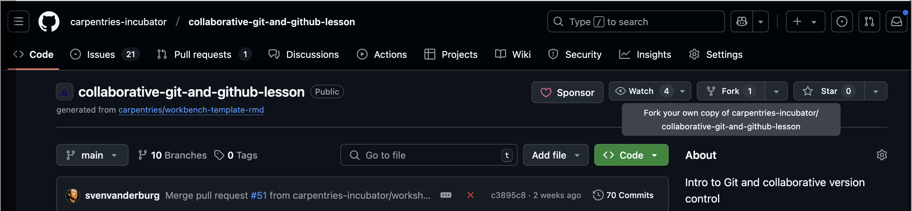
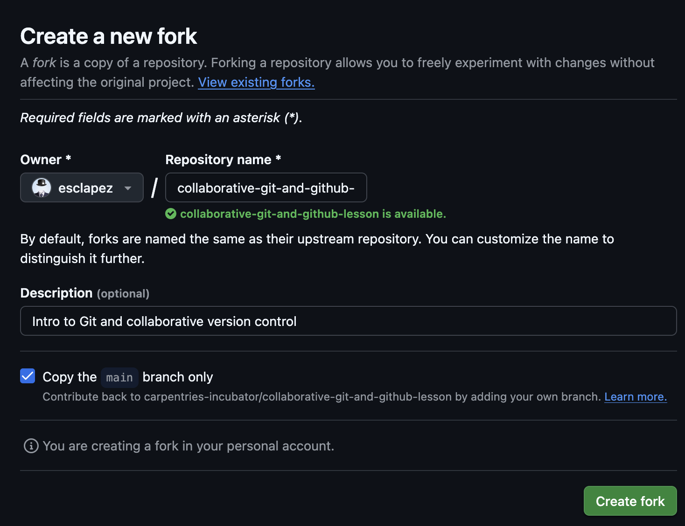
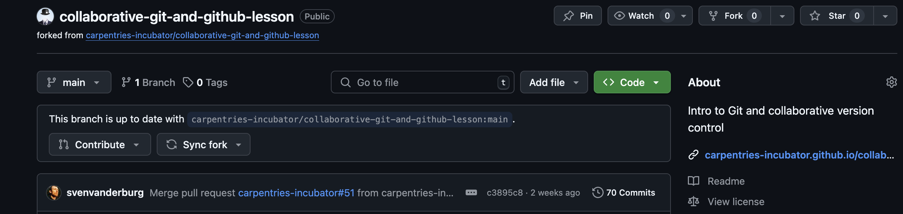
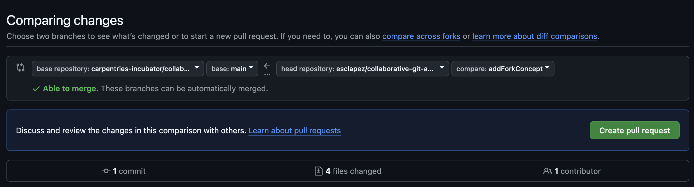

---
title: Collaborative Version Control - Distributed
teaching: 10
exercises: 60
---

:::::::::::::::::::::::::::::::::::::::: questions

- How can I use version control to collaborate with external collaborators?

::::::::::::::::::::::::::::::::::::::::::::::::::


::::::::::::::::::::::::::::::::::::::: objectives

- Introduce the concept of fork
- Understand distributed workflow and when to use it

::::::::::::::::::::::::::::::::::::::::::::::::::

## What is a fork ?

So far, we have seen how to use git to collaborate with internal collaborators,
i.e. with other people working on the same repository within the same organization.

Often times, we also want to collaborate or contribute to repositories not
owned by us or by an organization we belong to. In that case, we are not allowed to
push changes to the repository, and we need to use a different workflow.

Platforms like GihHub (or Gitlab) provide a way to create a mirror of a repository into
an organization we belong to. In GitHub lingo, this is called a fork. Although the fork
is a completely separate repository, GitHub keeps a dynamic link between the original
repository and your fork to facilitate collaboration (opening a Pull Request, syncing
changes, etc.).

## How to create a fork ?

Log in to [GitHub](https://github.com), then navigate to the repository you want to fork.
Then click on the "Fork" button near the top right corner:

{alt='Creating a fork of a repository (Step 1)'}

On the next page, you will have the choice to place the fork on your personal account
or any organization you belong to. You can also change the name of the forked repository.

{alt='Select a location and a name for the fork (Step 2)'}

After a few seconds, you will be redirected to the forked repository:

{alt='Your forked repository (Step 3)'}

## Opening a pull request from a fork

Once you have created your fork of the repository, you can clone the forked repository:

```bash
git clone https://github.com/username/forked-repo.git
```

or add the fork as a remote to an existing clone of the original repository:

```bash
cd original-repo
git remote add myfork https://github.com/username/forked-repo.git
```

Modify the content of the reposotory to your liking then add your contribution to a
new branch and push it to your fork (assuming you have added the fork as a new remote):

```bash
git checkout -b mybranch
git commit updatedfile -m "Add new feature"
git push myfork mybranch
```

Navigate to your fork of the repository in your web browser and from the Pull requests tab,
open a new pull request. By default, GitHub opens the pull request against the main branch
of the original repo:

{alt='Opening a Pull request from your fork into the original repository'}

::::::::::::::::::::::::::::::::::::::: instructor
Teaching is done as a pair of instructors. 
Instructor A acts as the owner of the repository, instructor B as a collaborator (internal or external).

Now we show distributed workflow. All in the browser using Github:

* Instructor A removes instructor B
* Instructor B now submits an issue
* Instructor A responds to issue asking instructor B to pick it up
* Instructor B forks repo, does some changes, and submits PR
* Instructor A reviews the changes
* Instructor B implements the changes
* Instructor A merges the pull request
* Use Github repo’s insights -> network to visualize what just happened 

::::::::::::::::::::::::::::::::::::::::::::::::::

::::::::::::::::::::::::::::::::::::::: challenge

### Exercise: Working as an external contributor (in pairs)

- PERSON A: Create an issue in Person B's repository
- PERSON A: Fork the repository to their own (= Person A's) account
- PERSON A: Clone the repository, make changes, push them back to the fork
- PERSON A: Submit a Pull Request from the fork to the original repository
- PERSON B: Make a change in the original repository in the same place as person A's proposed changes
- PERSON A: Solve the merge conflict in the Pull Request
- PERSON B: Review/Approve the Pull Request
- PERSON B: merge the Pull Request 
::::::::::::::::::::::::::::::::::::::::::::::::::

::::::::::::::::::::::::::::::::::::::: solution

::::::::::::::::::::::::::::::::::::::::::::::::::


:::::::::::::::::::::::::::::::::::::::: keypoints
* Use distributed flow for external collaborations
::::::::::::::::::::::::::::::::::::::::::::::::::
