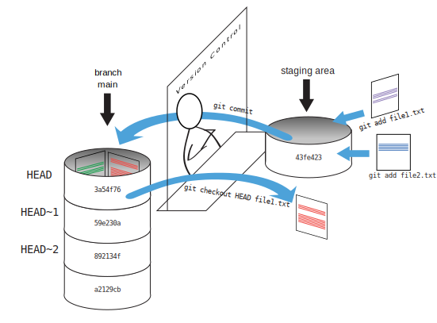

::::::::::::::::::::::::::::::::::::::: objectives

- Explain what the HEAD of a repository is and how to use it.
- Identify and use Git commit numbers.
- Compare various versions of tracked files.
- Restore old versions of files.

::::::::::::::::::::::::::::::::::::::::::::::::::

:::::::::::::::::::::::::::::::::::::::: questions

- How can I identify old versions of files?
- How do I review my changes?
- How can I recover old versions of files?

::::::::::::::::::::::::::::::::::::::::::::::::::

:::::::::::::::::::::::::::::::::::::::: instructor
There are no specific slides for this episode. You could consider keeping the slides open to the episode on the basics of Git, to show the visual representation of the changes in the repository.

Consider doing this episode as a demo and not as live coding if time is short. 
The aim is to demonstrate to participants the possibility to go back and forth through the git log, 
which is enough for an introduction to git. In practice, you only use this feature occasionally. 

::::::::::::::::::::::::::::::::::::::::::::::::::

In this episode you will learn some basic concepts about the git commit history.
Remember that git can serve as a sort of time machine, going back and forth between historical commits.
In practice, you only use this feature occasionally, so we will only explain some core concepts that will
allow you to go back and forth between commits (maybe with some help of a search engine, but at least you know what you are searching for).

### Two ways of referring to a commit
As we saw in the previous episode, one way we can refer to commits is by their
identifiers. The `Commit ID` is a 40-character random string, like: `f22b25e3233b4645dabd0d81e651fe074bd8e73b`. 

Since this is a unique hash, you can also refer to just the first few characters of the commit ID: `f22b25e`.

You can also refer to commits by using the identifier `HEAD`. `HEAD` points to the *most recent commit* of the working
directory. You can use `HEAD~1` to refer to previous commits relative to `HEAD` (where "~" is "tilde", pronounced [**til**\-d*uh*]).

The number behind `~` indicates the number of commits before `HEAD`. 
So `HEAD~2` points to two commits before `HEAD`.

See the overview figure below:

{alt='Git Staging'}

### Using `diff` with specific commits
We've been adding one line at a time to `mars.txt`, so it's easy to track our
progress by looking:

```bash
$ cat mars.txt
```

```output
Cold and dry, but everything is my favorite color
The two moons may be a problem for Wolfman
But the Mummy will appreciate the lack of humidity
```

Now, let's see the difference between the current version of the file and 2 commits before `HEAD`.

```bash
$ git diff HEAD~2 mars.txt
```

```output
diff --git a/mars.txt b/mars.txt
index df0654a..b36abfd 100644
--- a/mars.txt
+++ b/mars.txt
@@ -1 +1,4 @@
 Cold and dry, but everything is my favorite color
+The two moons may be a problem for Wolfman
+But the Mummy will appreciate the lack of humidity
```

We could also use `git show` which shows us what changes we made at an older commit as
well as the commit message, rather than the *differences* between a commit and our
working directory that we see by using `git diff`.

```bash
$ git show HEAD~2 mars.txt
```

```output
commit f22b25e3233b4645dabd0d81e651fe074bd8e73b
Author: Vlad Dracula <vlad@tran.sylvan.ia>
Date:   Thu Aug 22 09:51:46 2013 -0400

    Start notes on Mars as a base

diff --git a/mars.txt b/mars.txt
new file mode 100644
index 0000000..df0654a
--- /dev/null
+++ b/mars.txt
@@ -0,0 +1 @@
+Cold and dry, but everything is my favorite color
```

We can also refer to commits using commit IDs
Our first commit was given the ID
`f22b25e3233b4645dabd0d81e651fe074bd8e73b`,
and we know we can shorten that to `f22b25e`.

So let's try:

```bash
$ git diff f22b25e mars.txt
```

```output
diff --git a/mars.txt b/mars.txt
index df0654a..93a3e13 100644
--- a/mars.txt
+++ b/mars.txt
@@ -1 +1,4 @@
 Cold and dry, but everything is my favorite color
+The two moons may be a problem for Wolfman
+But the Mummy will appreciate the lack of humidity
```

### Restoring older versions
All right! So
we can save changes to files and see what we've changed. Now, how
can we restore older versions of things?

We can use the `git restore` command to do that.

We can use the 'source' flag `-s` to specify a commit identifier:

```bash
$ git restore -s f22b25e mars.txt
```

```bash
$ cat mars.txt
```

```output
Cold and dry, but everything is my favorite color
```

```bash
$ git status
```

```output
On branch main
Changes not staged for commit:
  (use "git add <file>..." to update what will be committed)
  (use "git restore <file>..." to discard changes in working directory)

    modified:   mars.txt

```

As you can see this changes the file to the version of the commit that we specified
using the `-s` flag.

We can put things back the way they were by using `git restore` again, 
by default it restores a file to the most recent commit:

```bash
$ git restore mars.txt
```

It's important to remember that
we must use the commit number that identifies the state of the repository
*before* the change we're trying to undo.
A common mistake is to use the number of
the commit in which we made the change we're trying to discard.
In the example below, we want to retrieve the state from before the most
recent commit (`HEAD~1`), which is commit `f22b25e`:

{alt='Git Restore'}

:::::::::::::::::::::::::::::::::::::::::  callout

## Simplifying the Common Case

If you read the output of `git status` carefully,
you'll see that it includes this hint:

```output
(use "git restore <file>..." to discard changes in working directory)
```

As it says,
`git restore` without a version identifier restores files to the state saved in `HEAD`.

::::::::::::::::::::::::::::::::::::::::::::::::::

The fact that files can be reverted one by one
tends to change the way people organize their work.
If everything is in one large document,
it's hard (but not impossible) to undo changes to the introduction
without also undoing changes made later to the conclusion.
If the introduction and conclusion are stored in separate files,
on the other hand,
moving backward and forward in time becomes much easier.

:::::::::::::::::::::::::::::::::::::::  challenge

## Recovering Older Versions of a File

Jennifer has made changes to the Python script that she has been working on for weeks, and the
modifications she made this morning "broke" the script and it no longer runs. She has spent
\~ 1hr trying to fix it, with no luck...

Luckily, she has been keeping track of her project's versions using Git! Which commands below will
let her recover the last committed version of her Python script called
`data_cruncher.py`?

1. `$ git restore`

2. `$ git restore data_cruncher.py`

3. `$ git restore -s HEAD~1 data_cruncher.py`

4. `$ git restore -s <unique ID of last commit> data_cruncher.py`

5. Both 2 and 4

:::::::::::::::  solution

## Solution

The answer is (5)-Both 2 and 4.

The `restore` command restores files from the repository, overwriting the files in your working
directory. Answers 2 and 4 both restore the *latest* version *in the repository* of the file
`data_cruncher.py`. Answer 2 doesn't specify a commit, which means it automatically refers to the
*latest*, whereas answer 4 uses the unique ID of the last commit, which would be the same as
using `HEAD` instead.

Answer 3 gets the version of `data_cruncher.py` from the commit *before* `HEAD`, which is NOT
what we wanted.

Answer 1 reports an error `fatal: you must specify path(s) to restore`: you haven't specified
which file(s) to restore. It's a good idea to be specific about which files you mean,so you
don't accidentally restore more files than you need. If you do want to restore all previously
committed files in your repository, you can use `.` to specify the current folder (and all
subfolders), i.e., `git restore .`.


:::::::::::::::::::::::::

::::::::::::::::::::::::::::::::::::::::::::::::::

:::::::::::::::::::::::::::::::::::::::  challenge

## Reverting a Commit

Jennifer is collaborating with colleagues on her Python script.  She
realizes her last commit to the project's repository contained an error, and
wants to undo it.  Jennifer wants to undo correctly so everyone in the project's
repository gets the correct change. The command `git revert [erroneous commit ID]` will create a
new commit that reverses the erroneous commit.

The command `git revert` is
different from `git restore -s [commit ID]` because `git restore` returns the
files not yet committed within the local repository to a previous state, whereas `git revert`
reverses changes committed to the local and project repositories.

Below are the right steps and explanations for Jennifer to use `git revert`,
what is the missing command?

1. `________ # Look at the git history of the project to find the commit ID`

2. Copy the ID (the first few characters of the ID, e.g. 0b1d055).

3. `git revert [commit ID]`

4. Type in the new commit message.

5. Save and close

:::::::::::::::  solution

## Solution

The command `git log` lists project history with commit IDs.

The command `git show HEAD` shows changes made at the latest commit, and lists
the commit ID; however, Jennifer should double-check it is the correct commit, and no one
else has committed changes to the repository.


:::::::::::::::::::::::::

::::::::::::::::::::::::::::::::::::::::::::::::::

:::::::::::::::::::::::::::::::::::::::  challenge

## Understanding Workflow and History

What is the output of the last command in

```bash
$ cd planets
$ echo "Venus is beautiful and full of love" > venus.txt
$ git add venus.txt
$ echo "Venus is too hot to be suitable as a base" >> venus.txt
$ git commit -m "Comment on Venus as an unsuitable base"
$ git restore venus.txt
$ cat venus.txt #this will print the contents of venus.txt to the screen
```

1. ```output
  Venus is too hot to be suitable as a base
  ```
2. ```output
  Venus is beautiful and full of love
  ```
3. ```output
  Venus is beautiful and full of love
  Venus is too hot to be suitable as a base
  ```
4. ```output
  Error because you have changed venus.txt without committing the changes
  ```

:::::::::::::::  solution

## Solution

The answer is 2.

The command `git add venus.txt` places the current version of `venus.txt` into the staging area.
The changes to the file from the second `echo` command are only applied to the working copy,
not the version in the staging area.

So, when `git commit -m "Comment on Venus as an unsuitable base"` is executed,
the version of `venus.txt` committed to the repository is the one from the staging area and
has only one line.

At this time, the working copy still has the second line (and
`git status` will show that the file is modified). However, `git restore venus.txt`
replaces the working copy with the most recently committed version of `venus.txt`.

So, `cat venus.txt` will output

```output
Venus is beautiful and full of love.
```

:::::::::::::::::::::::::

::::::::::::::::::::::::::::::::::::::::::::::::::

:::::::::::::::::::::::::::::::::::::::  challenge

## Checking Understanding of git diff

Consider this command: `git diff HEAD~9 mars.txt`. What do you predict this command
will do if you execute it? What happens when you do execute it? Why?

Try another command, `git diff [ID] mars.txt`, where [ID] is replaced with
the unique identifier for your most recent commit. What do you think will happen,
and what does happen?


::::::::::::::::::::::::::::::::::::::::::::::::::

:::::::::::::::::::::::::::::::::::::::  challenge

## Getting Rid of Unstaged Changes

`git restore` can be used to restore a previous commit when unstaged changes have
been made, try it out by making some changes to `mars.txt`.

Then use `git restore mars.txt` to revert the change.

:::::::::::::::  solution

## Solution
Add a line to `mars.txt`:

```bash
$ nano mars.txt
$ cat mars.txt
```

```output
Cold and dry, but everything is my favorite color
The two moons may be a problem for Wolfman
But the Mummy will appreciate the lack of humidity
An ill-considered change
```

We can put things back the way they were
by using `git restore`:

```bash
$ git restore mars.txt
$ cat mars.txt
```

```output
Cold and dry, but everything is my favorite color
The two moons may be a problem for Wolfman
But the Mummy will appreciate the lack of humidity
```

:::::::::::::::::::::::::

::::::::::::::::::::::::::::::::::::::::::::::::::

:::::::::::::::::::::::::::::::::::::::: keypoints

- `git diff` displays differences between commits.
- `git restore` recovers old versions of files.

::::::::::::::::::::::::::::::::::::::::::::::::::


